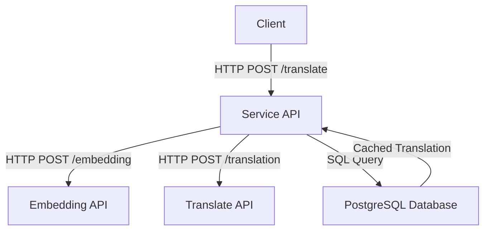
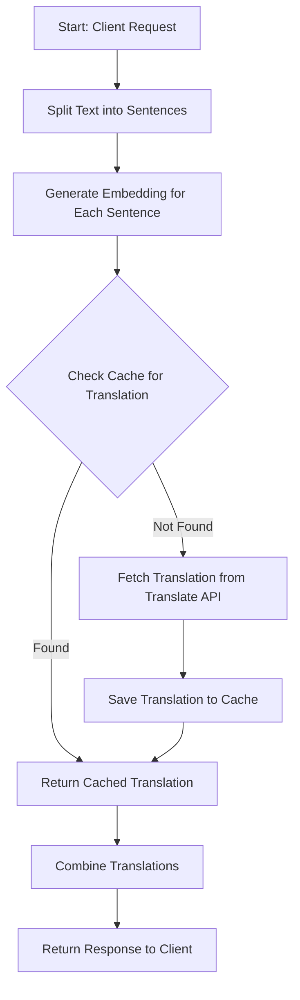

# Translations API

This repository provides a modular and scalable translation service built with multiple APIs, a PostgreSQL database with `pgvector` for vector similarity, and Docker Compose for orchestration. The service supports embedding generation, caching translations, and querying translations efficiently.

---

## Features

- **Translation API**: Handles text translation between languages.
- **Embedding API**: Generates embeddings for text to enable similarity-based caching.
- **Service API**: Orchestrates translation and caching logic.
- **PostgreSQL with `pgvector`**: Stores translations and embeddings for efficient similarity queries.
- **Docker Compose**: Orchestrates the APIs and database.

---

## Architecture

The system consists of the following components:

1. **Translate API**: Handles translation requests.
2. **Embedding API**: Generates embeddings for input text.
3. **Service API**: Combines translation and embedding logic, caches results in the database, and retrieves cached translations when possible.
4. **PostgreSQL Database**: Stores translations, embeddings, and supports similarity queries using `pgvector`.

### Architectural Diagram



---

## Translation Logic Flow

The following flowchart describes the logic of the translation process:



---

## Getting Started

### Prerequisites

- Docker and Docker Compose installed on your system.
- Go installed for local development of the Service API.

### Setup

1. Clone the repository:
   ```bash
   git clone https://github.com/yourusername/translationsapi-py.git
   cd translationsapi-py
   ```

2. Build and start the services:
   ```bash
   docker-compose up --build
   ```

3. Access the services:
   - **Service API**: `http://localhost:8080/translate`
   - **Translate API**: `http://localhost:8002`
   - **Embedding API**: `http://localhost:8001`
   - **PostgreSQL**: `localhost:5432`

---

## API Endpoints

### Service API

#### `POST /translate`
- **Description**: Translates text between languages, using cached translations when available.
- **Request Body**:
  ```json
  {
    "text": "Hello world",
    "source_language": "en",
    "target_language": "es"
  }
  ```
- **Response**:
  ```json
  {
    "translation": "Hola mundo"
  }
  ```

---

## Database Schema

The `translations_cache` table is used to store translations and embeddings:

```sql
CREATE TABLE IF NOT EXISTS translations_cache (
    id SERIAL PRIMARY KEY,
    source_language TEXT NOT NULL,
    target_language TEXT NOT NULL,
    source_text TEXT NOT NULL,
    target_text TEXT NOT NULL,
    embedding VECTOR(384)
);

CREATE INDEX IF NOT EXISTS idx_translations_cache_embedding
ON translations_cache USING ivfflat (embedding vector_cosine_ops) WITH (lists = 100);
```

---

## Environment Variables

The following environment variables are required:

| Variable          | Description                          | Default Value |
|--------------------|--------------------------------------|---------------|
| `DATABASE_URL`     | PostgreSQL connection string         | None          |
| `EMBEDDING_URL`    | URL for the embedding API            | None          |
| `TRANSLATE_URL`    | URL for the translation API          | None          |
| `PORT`             | Port for the Service API             | `8080`        |

---

## Development

### Running Locally

1. Install dependencies for the Service API:
   ```bash
   cd service
   go mod download
   go run main.go
   ```

2. Start the database and other APIs using Docker Compose:
   ```bash
   docker-compose up db translateapi embedapi
   ```

---

## Testing

You can test the APIs using tools like `curl` or Postman.

Example `curl` request to the Service API:
```bash
curl -X POST http://localhost:8080/translate \
-H "Content-Type: application/json" \
-d '{
  "text": "Hello world",
  "source_language": "en",
  "target_language": "es"
}'
```

---

## Future Improvements

- Add support for more languages.
- Implement rate limiting for APIs.
- Add monitoring and logging for better observability.

---

## License

This project is licensed under the MIT License. See the [LICENSE](LICENSE) file for details.
